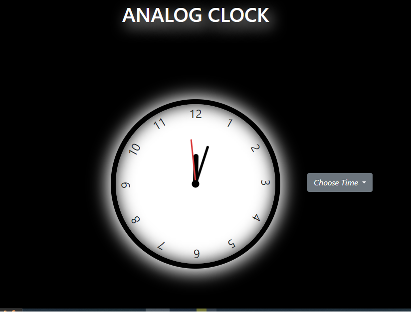

# Analog_watch

It's an Analog Watch with set timer fucntion and also have alarm sound when the timer completed.
By Click on choose time there open a menu with 2 option's.
First talk about second option which is "Set time" .
by clicking on Set Time a select timer menu popup by which you can choose Start Time and End Time for timer.
If you miss either of them start time or end time and clicked on submit button so then you get a error messege which tells you to select both.
After selecting both time and click on submit button the timer starts between your selected time.
When the timer completed you get an Alert that the time is completed and you can choose time for timer again or you can choose current time.
Now you can choose timer again or choose current time option from the menu
On clicking on current time option the clock reset to the systems curent time.
